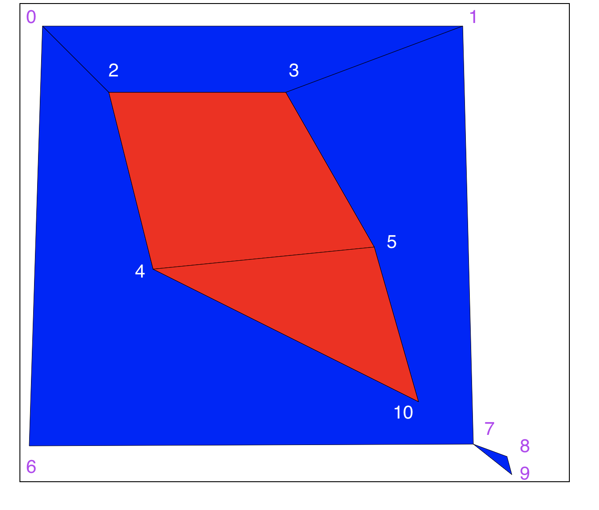

# Higharc Project
A humble attempt to implement some fun algorithms in javascript (as vanilla as possible)

## TL;DR
#### Live App (Fake, just static files lol)
[Link](https://codepen.io/LeoYuanjieLi/pen/WNzZEPo)
Here is a reference image of the vertices ids.

### View result of Algorithms 1 & 2
In `App.js`, enable `line 378` for algorithm 1, the other for algorithm 2
```javascript
Draw.drawAllFacesAlgorithm1(inputJson); // use this to view algorithm 1 result;
// Draw.drawAllFacesAlgorithm2("0,1,2,3", inputJson); // use this to view algo 2 result;
// Draw.drawAllFacesAlgorithm2("4,5,10", inputJson); // use this to view algo 2 result;
// Draw.drawAllFacesAlgorithm2("7,8,9", inputJson); // use this to view algo 2 result;
// Draw.drawAllFacesAlgorithm2("0,1,2,3,4,5,6,7,10", inputJson); // use this to view algo 2 result;
```
The main idea of the algorithm is not very clever, the `Polygons.constructFace` does the most of the work
by construct a single `Face` object. The way `constructFace` method simply uses a greedy algorithm to search
for the `right most` edge from the current edge (see helper function `getNextId` and `edgeAngle`).

The whole process goes in this order:

1. find the very top vertices, then draw a line from this point to direction (x:1, y:0), and find
the rightmost edges (rotate clockwise) from this direction.
2. use this edge, apply `constructFace` function, this way, you can build the parameter of the polygons,
simply recorded the visited edges.
3. Now, use a BFS fashion, put all edges as starting edge, except for the one visited in step 2, note that
edges has direction, `1-2` is not the same as `2-1`, tag the face as `exterior` if any edge is in 
`exterior edge`, otherwise, tag as `interior`.

After we build above data structure, retrieving the interior faces (algorithm 1) is trivial. 
Just loop through them. (Update) because there are no overlap edges, we are sure that each 2 nodes
can only form at least 1 edge (2 if directional), so `e` and `v` are the same level of count
(i.e. `e` = A * `v`, A is a constant between 1 and 3). The function `constructFace` time complexity
is `e * some_constant`, this is because for each edge, we are searching all its neighbors. the total
number of neighbors are `e` so if we average out to each edge, it is constant time.
Construct all edges hence takes `e` edges and each is time `e` to construct, hence constructing all
edges takes `O(e**2)` -> `O(v**2)`

The neighbor search is also trivial. You just have to rerun construct face from all edges and check if 
the face is the original face. Faces are guaranteed to be unique with the incrementally sorted vertex Ids
i.e. face name `0,1,2` would be a name of face contains `0-1`, `1-2`, `0-2`.

Algorithm 2 worst case, you can get `O(v**2)` as well.

Algorithm 4 is just the extension of algorithm 2 (add a BFS and build a graph), 
see `Polygons.getFacesInOrder` method. It is a simple BFS on top of `Polygons.getNeighborFaces`,
you can run it but also verify it in the last test of `Polygons.test.js` file. Time complexity should
still be `O(v**2)`.

Algorithm 3 is more tricky. Ideally, you have several zones in your XY world plain (build it as a 
quad-tree). Then you can quickly eliminate spaces. For the sake of this assignment, we can use
https://www.geeksforgeeks.org/how-to-check-if-a-given-point-lies-inside-a-polygon/ this brute force
approach. However we have to check if the intersection line are also vertices of the face, if so it 
should be excluded.


## Run locally
```bash
npm install
npm run dev
```

## Test
```bash
npm run test
```
## Disclaimer

As the assignment mentioned, I am using JavaScript as vanilla js as possible, hence I 
encounter some troubles while trying to `import`, `require` js files. To bypass
those hassle, I squeeze all `Draw`, `Edge`, `Face`, `Polygon` classes (yes they 
are classes I am an old school OOP person) into `App.js`. These days I cannot live
without `create-react-app` for any frontend development. Configuration is a pain.
Would love to learn some more js/ts stuff from you :)


## TODO:

- [x] hash face name with verts;
- [x] modify neighbor function so that point touching does not count as neighbors
- [x] documentations
- [x] algorithm 4 implemented and tested
- [ ] algorithm 3